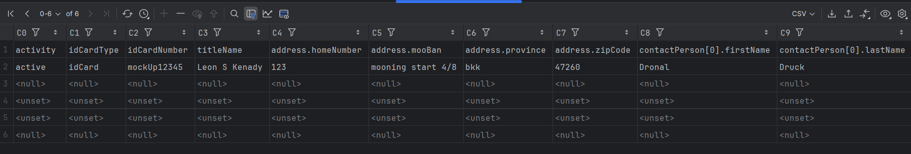
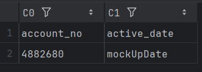

# Auto Generate Request
## Send Request And Save Response

This project use basic python to generate request parameter from your excel and send request to your endpoint within save your response into your excel

### Previews

### Request Excel


### Response Excel


---

### 🔧 Install Dependencies

```bash
# 1. Create a virtual environment
python -m venv venv

# 2. Activate the environment
source venv/bin/activate     # On Windows use: venv\Scripts\activate

# 3. Install required packages
pip install -r requirements.txt
```

### 🚀 Run Script

```bash
# 1. Fix Your Child Path
change os.chdir() at line: 19 

# 2. Run Your Python
python .\src\dynamic_create_account.py --dm https://your-domain --rc 10
